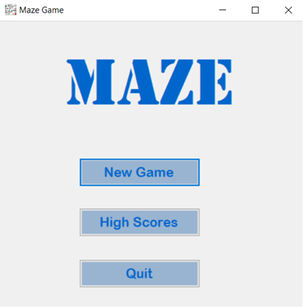
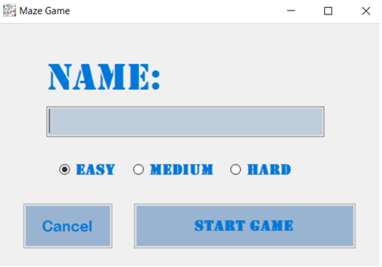
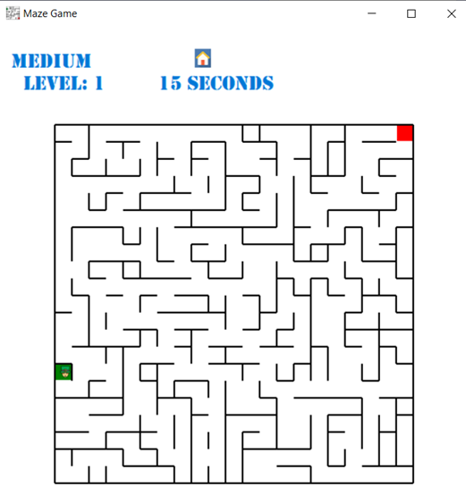
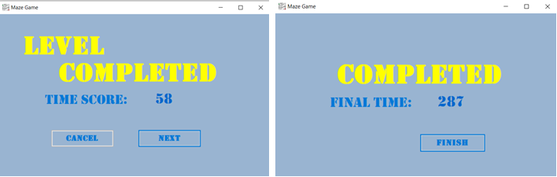
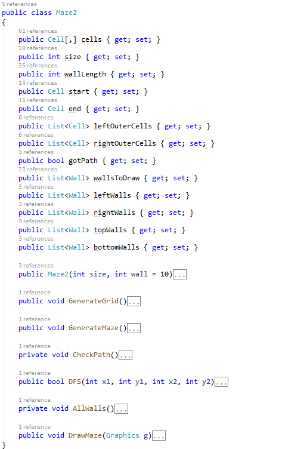

# Maze Game

## Изработено од:
### Филип Ангелов 183008
### Дарија Петрова 173006

#### За тема на нашата проектна задача одбравме да ја имплементираме играта "Maze Game", инспирирана од игричките со лавиринти во списанија и некои слични игрички што ги имаме играно на компјутер и smartphone, со наши идеи.

## Опис на играта

### Изглед на почетната форма
#### При стартување на играта се појавува почетната форма со опциите за започнување нова игра, поглед на најдобри постигнати резултати и излез од играта.

#### За да започне играчот со играта треба да креира нова игра. Со притискање на копчето New Game тој добива форма за внсување на име и избор на тежинско ниво кое сака да го игра (Easy, Medium, Hard), не може да ја започне играта доколку не внесе име. Играта може да ја започне со притискање на копчето Start Game, или да се откаже од почнување нова игра со притискање на копчето Cancel.
### Изглед на прозорецот за креирање нова игра

#### Целта на играта е играчот со движење на фигурата да го најде патот од почетната точка(зелен квадрат) до крајната точка(црвен квадрат) низ дадениот лавиринт за што е можно пократко време. Доколку фигурата дојде до ѕид не може да оди напред мора да му се промени насоката.
#### Секое од трите тежински нивоа има 10 поднивоа, при што се поминување на секое подниво, следниот лавиринт се зголемува и станува покомплексен. Краен резултат за колку време ги има поминато сите новиоа добива играчот со поминување на последното (10-то) подниово во соодветно избраното тежинско ниво. Доколку играчот се откаже во текот на играњето дотогашниот постигнат резултат не се зачувува. По поминувањето на 10-те поднивоа играта завршува и резултатот на играчот (вкупното времето за кое се поминати 10-те поднивоа) доколку е во најдобрите 5 се запишува во соодветната листа на најдобри резултати.

### Начин на играње
#### Играта се игра со четирите копчиња UP, LEFT, RIGHT и DOWN односно стрелките од тастатурата. Со притаскање на едно од копчињата се движи играта во соодветната насока низ слободниот простор, доколку дојде до ѕид фигурата застанува и ќе мора да се промени насоката на движење.

### Изглед на играта

### Изглед на прозорците за успешно завршено подниво и успешно завршено 10-то подниво

### Изглед на прозорецот за најдобри резултати
#### Тука се прикажуваат резултатите за најдобрите 5 играчи според најкраткото време на завршување на сите 10 поднивоа за секое тежинско ниво

#### Податоците се чуваат во листи од играчи соодветно во посебна листа за секое тежинско ниво. Податоците за играчите се сериализирани и се достапни и по исклучување на играта.

### Креирање на нов лавиринт
#### При стартување на играта соодветно од првиот избор на ниво започнува да се креира нов лавиринт кој според употребените алгоритми секогаш ќе најде барем еден пат од почетокот до крајот а понекогаш и повеќе патишта. За секое избрано ниво се следните поднивоа на лавиринти: Easy, првото ниво започнува со матрица 11х11 и во секое наредно ниво се зголемува за 1 матрицата, односно наредна големина ќе биде 12х12, се до 20х20, Medium од 21х21 до 30х30, Hard од 31х31 до 40х40.

### Класта Maze2, алгоритми и податочни структури
#### Оваа класа всушност е репрезентација на граф со помош на мтарица. Матрицата содржи келии, претставени во класата Cell, оваа класа ни е како замислена келија во Excel. Класата Maze2 е прилагодена според потребите на играта/проектот и во неа се користат некои од познатите алгоритми за наоѓање и креирање на пат во граф. Главна податочна структура ни е граафот. а графот всушност ни претставува и самиот лавиринт во играта.
##### Функцијата GenerateMaze() е всушност Recursive backtracker алгоритмот имплементиран со помош на податочната структура Stack и модифицран според потребите, оваа функција ја користиме за да создадеме пат.
##### Функцијата DFS(int x1, int y1, int x2, int y2) е модифицирана верзија на алгоритмот Depth First Search, со оваа фунцкија проверуваме дали имаме пат од Start до End, овде исто така користиме Stack
##### Функцијата AllWalls() ни служи како помош за одредување на ѕидовите на која страна од келијата се, со што соодветно ги пополнувеаме лиситите wallsToDraw(за цртање на сите ѕидови без повторување), leftWalls, rightWalls, topWalls, bottomWalls кои служат за соодветна проверка на правецот на движење.

